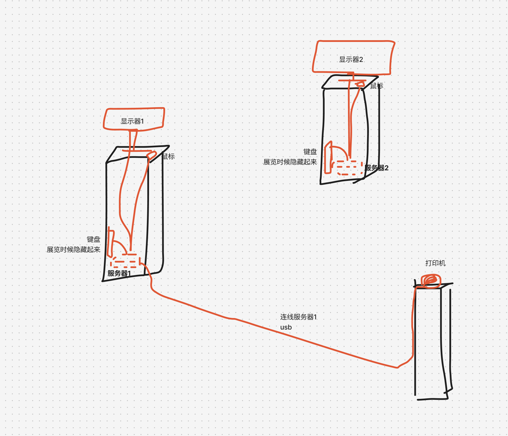

# 『众鸣山』两台服务器部署与自启动脚本指南

**日期**：2025/3/9  
**作者**：zzyw  

---

## 总览

- **Station1**  
  - 连接 Epson TM T82III 热敏打印机 (USB)。  
  - 作为主服务器，负责数据库与 AI (LLM) 接口调用。  
  - 需要在系统启动后，双击 `start01.sh` 快捷方式以启动服务。  

- **Station2**  
  - 无需打印机。  
  - 通过局域网与 Station1 同步故事进程。  
  - 系统启动后，双击 `start02.sh` 快捷方式即可运行并与 Station1 通信。  



---

## Station 1 服务器设置指南

| 一次性设置                                                                                                                                           | 每日启动步骤                                                          |
|------------------------------------------------------------------------------------------------------------------------------------------------------|-----------------------------------------------------------------------|
| 1. **安装 Node.js** (≥14版本)<br>- 从 [Node.js官网](https://nodejs.org/) 下载安装<br>- 检查安装: `node -v`                                           | 1. **确保打印机已连接并通电**                                         |
| 2. **安装 Git** (如未自带)<br>- 检查: `git --version`<br>- 若未安装: `xcode-select --install`                                                        | 2. **双击桌面上的 `start01.sh` 快捷方式**                             |
| 3. **获取项目代码**<br>- `cd ~`<br>- `git clone https://github.com/ZZYW/momv.git`<br>- `cd momv`<br>- `npm install`                                  | 3. **验证服务启动**<br>- 浏览器访问: `http://localhost:3001/station1` |
| 4. **创建环境配置**<br>- `touch .env`<br>- `echo "DASHSCOPE_API_KEY=your_dashscope_api_key" > .env`<br>- `echo "PORT=3001" >> .env`<br>- 替换API密钥 |                                                                       |
| 5. **连接热敏打印机**<br>- 连接 Epson TM T82III 至USB端口                                                                                            |                                                                       |
| 6. **获取IP地址给Station2使用**<br>- `ipconfig getifaddr en0` (以太网)<br>- 或 `ipconfig getifaddr en1` (WiFi)<br>- 记下此IP用于Station2配置         |                                                                       |
| 7. **设置快捷方式**<br>- 在Finder中找到`start01.sh`<br>- 按住`Option+Command`将文件拖到桌面<br>- 或右键>"制作别名"后拖至桌面                         |                                                                       |
|                                                                                                                                                      |                                                                       |

## Station 2 服务器设置指南

| 一次性设置                                                                                                                                                                      | 每日启动步骤                                                          |
|----------------------------------------------------------------------------------------------------------------------------------------------------------------------------|-----------------------------------------------------------------------|
| 1. **安装 Node.js** (≥14版本)<br>- 从 [Node.js官网](https://nodejs.org/) 下载安装<br>- 检查安装: `node -v`                                                                      | 1. **双击桌面上的 `start02.sh` 快捷方式**                             |
| 2. **安装 Git** (如未自带)<br>- 检查: `git --version`<br>- 若未安装: `xcode-select --install`                                                                                   | 2. **验证服务启动**<br>- 浏览器访问: `http://localhost:3001/station2` |
| 3. **获取项目代码**<br>- `cd ~`<br>- `git clone https://github.com/ZZYW/momv.git`<br>- `cd momv`<br>- `npm install`                                                             |                                                                       |
| 4. **创建环境配置**<br>- `touch .env`<br>- `echo "PORT=3001" > .env`<br>- `echo "CENTRAL_BACKEND_URL=http://STATION1_IP:3001" >> .env`<br>- 替换`STATION1_IP`为Station1的实际IP |                                                                       |
| 5. **设置快捷方式**<br>- 在Finder中找到`start02.sh`<br>- 按住`Option+Command`将文件拖到桌面<br>- 或右键>"制作别名"后拖至桌面                                                    |                                                                       |

---

## 项目更新 (适用于两台服务器)

当创作者提供新功能或补丁时，在两台机器的终端中执行：

```bash
cd ~/momv
git pull
npm install
```

然后重新双击对应脚本`start01.sh`或`start02.sh`启动服务。

如果脚本有变化，请确保执行：
```bash
chmod +x start01.sh
chmod +x start02.sh
```

---

## 联系与支持

如现场遇到无法解决的技术问题，请联系我们以获取远程支持或进一步指导。